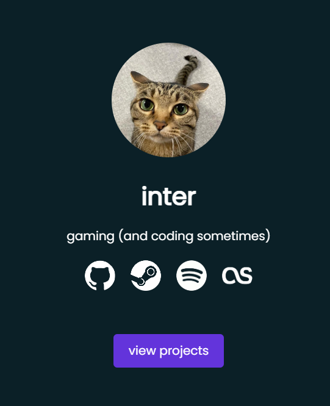
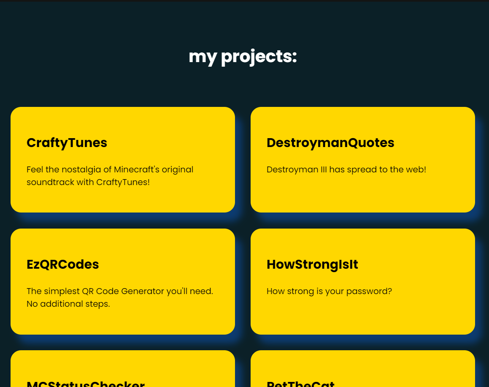

# portfolio/social links ☕

 

### a simple portfolio website that also serves as the links page for my socials!

# <u>preview</u>

# <u>project page preview</u>

# want to use this as a template? 📕

clone this repository by using:

┃ https: ┃ 

`git clone https://github.com/inttter/portfolio`

┃ github cli ┃ 

`gh repo clone inttter/portfolio`

# acknowledgements 🏆

[boxicons]([BoxIcons.com) for the various icons

# license ⚖️

my portfolio/website links website is licensed under the MIT License.

see [license](LICENSE) for more information!

# feel free to donate to me 🎧

 

###### 🥞 made with HTML, CSS, and JS 🥞
