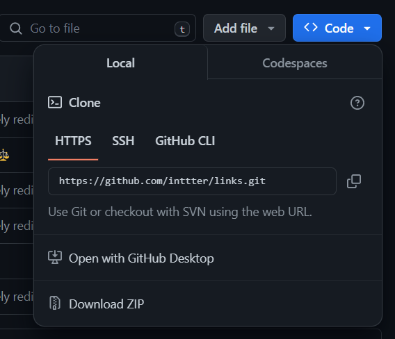

i

# Links 🔗

 

)

A minimal website to display my links and projects.

# Want to use this for your own? ✏️

Clone the repository and edit anything you wish:

`git clone https://github.com/inttter/links`

Make sure to replace everything with references to **yourself**.

# Acknowledgements 🏆

Many tools were used to create this: 

[kittinan/spotify-github-profile](https://github.com/kittinan/spotify-github-profile) for the Spotify Now Playing status image.

[tarptaeya/repo-card](https://github.com/tarptaeya/repo-card) for the cards showing my Featured Projects.

#### [inttter/md-badges](https://github.com/inttter/md-badges), **my own project**, for the badge SVG's.

[OneShot](https://store.steampowered.com/app/420530/OneShot/) for "On Little Cat Feet" (made by Nightmargin), featured in the game!

# License ⚖️

©️ MIT License • [View Here](LICENSE)

###### made with 🥞 - get it? probably not.